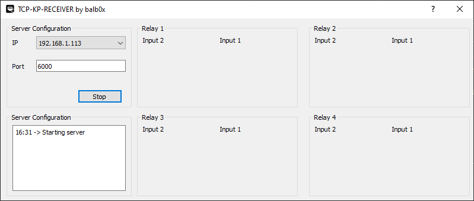

# TCP-KP UDP RECEIVER

The TCP-KP-I202 is a remote controlled IOT device introduced by Clayman Technology. It can perform the remote control and data acquisition of UDP/TCP packets over the net

For this project, the device is configured to act as an udp broadcast sender. So it emits packets every second containing the state of the inputs of the device.

The configuration and data visualization are carried by AT-Commands. There are some Chinese PDFs which have a detailed relation of each command.    

The purpose of this project is to visualize the input states of the device in real time. The provided software is a bit complex, cannot change the language to english/spanish and you could only monitorize on device at a time.  

Tested on these devices:

- TCP-KP-I202

## Requirements

Needed packages are linked in the `requirements.txt` file, to install them:

``` pip3 install -m requirements.txt ```

## Run

To run the script just type:

``` python3 main.py ```

## Current UI




### TODO

- Enable selection of the remote devices (show/hide)